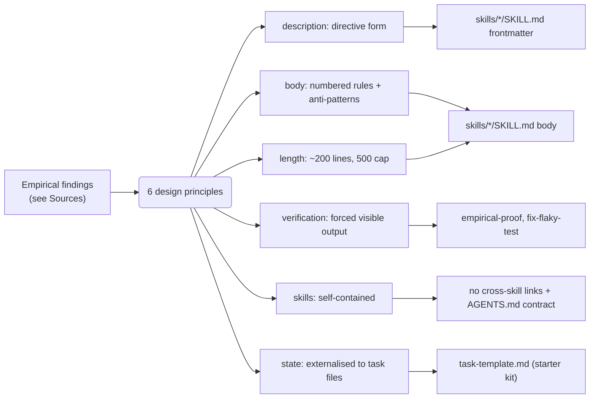

# 📚 The science behind these skills

> Skills are agent prompts. Like any prompt, they have measurable failure modes. This directory documents the empirical evidence that shaped the structural choices in this catalog and in the [Corpus starter kit's](https://github.com/jcosta33/corpus-starter-kit) guides — from the wording of a `description` field to the absence of any automation in the repo.

Every choice in [`README.md`](../README.md), [`AGENTS.md`](../AGENTS.md), and the shipped skills traces to one of the documents below. If a contributor asks **"why is the description in this form?"**, **"why are there no scripts in this repo?"**, or **"why don't skills reference each other?"** — the answer is here, with a citation, not a hunch.

---

## What's in this directory

| Document                                      | What it documents                                                                                                                         |
| --------------------------------------------- | ----------------------------------------------------------------------------------------------------------------------------------------- |
| [**Activation**](./activation.md)             | Why every `description` is in directive form, the exclusion-clause discipline, the compliance ceiling                                     |
| [**Body anatomy**](./body-anatomy.md)         | Numbered rules with rationale, length budgets, anti-patterns sections, reference depth                                                    |
| [**Execution**](./execution.md)               | The two reliability problems; the forced-visible-output fix; Reflexion as the deeper pattern                                              |
| [**Self-containment**](./self-containment.md) | Why skills don't reference each other; the `AGENTS.md` contract; file-based state externalisation                                         |
| [**Task files**](./task-files.md)             | How task templates relate to plan-mode files; why most workflow skills ship one and a few don't; Anthropic's three-file canonical pattern |
| [**Scope**](./scope.md)                       | What belongs here, what deliberately doesn't, and the principle behind each exclusion                                                     |
| [**Sources**](./sources.md)                   | Full bibliography. Every claim in this directory cites one of these                                                                       |

---

## The findings, in one paragraph

A controlled 650-trial experiment measured Claude Code skill activation across three description styles and four environment conditions [\[3\]](./sources.md#3). Passive _"Use when …"_ descriptions activated 50–77 % of the time and **collapsed to 37 % under hooks**. Directive descriptions — _"ALWAYS apply this skill when … Do not Y. Skip for Z."_ — activated **100 % of trials**, with ~20× higher odds (CMH OR = 20.6, p < 0.0001). A separate analysis distinguished that activation failure from a different failure mode where late-stage verification steps inside an already-loaded skill get **silently skipped** because they delay output without producing visible content [\[4\]](./sources.md#4) — the same verbal-feedback discipline Reflexion [\[27\]](./sources.md#27) showed lifts HumanEval pass@1 from 80 % to 91 %. Anthropic's official guidance adds a 500-line body cap [\[2\]](./sources.md#2) anchored in the U-shaped attention curve [\[5\]](./sources.md#5)[\[30\]](./sources.md#30), and a **canonical three-file note-taking pattern** for long-running tasks (`task_plan` / `progress_log` / `decisions`) [\[20\]](./sources.md#20) — vendor-grade validation of file-based state externalisation, which an InfiAgent ablation [\[29\]](./sources.md#29) measured at **21× performance degradation when removed**. The ETH Zurich `AGENTS.md` study [\[32\]](./sources.md#32) closes the loop: tool-specific commands have **2.5× the impact when present**, but LLM-generated narrative context costs **+20 % for –3 % success** — the empirical case for the split between universal _how-to-work_ skills and project-specific `AGENTS.md` _what-to-run_ commands.

Everything in this directory applies that paragraph to specific structural choices in the skills.

---

## How the principles map to the codebase

Each principle has a dedicated document in this directory; the [Sources](./sources.md) page lists the primary evidence behind every link in the chain.

---

## Living document

This is a working record, not a frozen artefact. When a new primary source materially changes a design choice, the relevant document and the [Sources](./sources.md) entry are updated together. If a source's URL goes dead, the citation is replaced or marked `[archived]`.

---

Grounded in primary sources · Maintained alongside the skills they explain.

