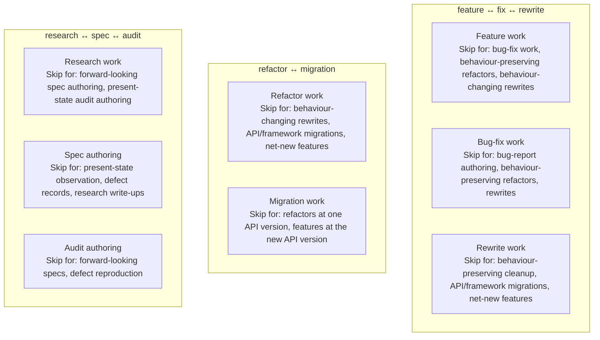
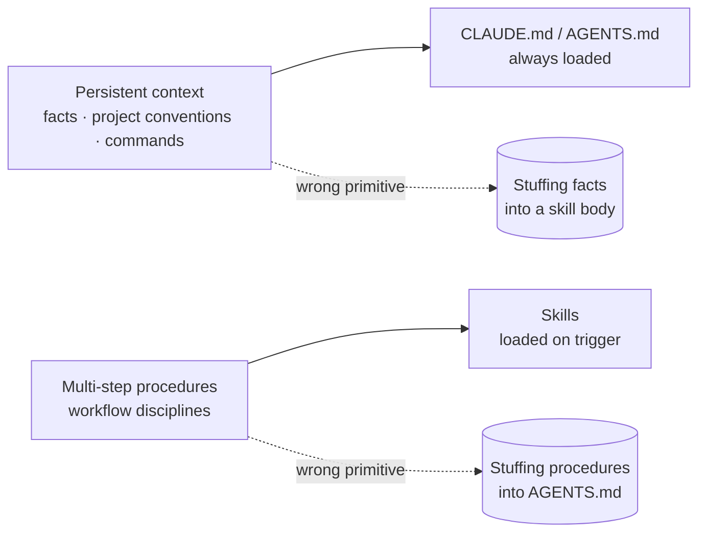

# Activation

> **Why every `description` starts with an imperative verb, says "ALWAYS apply this skill when …", and ends with "Skip this skill for …"**

The `description` field is the most load-bearing line in any `SKILL.md`. Agents scan it to decide whether to load the skill into context. Get it wrong, and the most carefully written body never runs.

---

## The evidence

Ivan Seleznov's controlled study [\[3\]](./sources.md#3) ran **650 automated trials** across three description styles, four environment conditions, eighteen user queries, and three repetitions per cell. Activation was verified against the ground-truth session log via `cclogviewer`, not by self-report.

| Description style                                                                                                              | Plain prompt | With hooks | With CLAUDE.md context | Combined  |
| ------------------------------------------------------------------------------------------------------------------------------ | ------------ | ---------- | ---------------------- | --------- |
| **Passive** — _"Use when implementing a feature from a spec…"_                                                                 | 77 %         | **37 %**   | 50 %                   | ~55 %     |
| **Imperative-without-exclusion** — _"Implement features. ALWAYS use when…"_                                                    | 90 %         | 70 %       | 78 %                   | ~80 %     |
| **Directive-with-exclusion** — _"Implement features. ALWAYS apply this skill when… Do not Y directly. Skip this skill for Z."_ | **100 %**    | **100 %**  | **100 %**              | **100 %** |

The Cochran-Mantel-Haenszel test isolates the description style as the active variable: **OR = 20.6, p < 0.0001**. Open data and analysis at [SeleznovIvan/claude-skills-test](https://github.com/SeleznovIvan/claude-skills-test).

> Two independent practitioner studies converge on the same conclusion. Bilgin Ibryam's pattern catalogue elevates the exclusion clause to _"the single most important line in the description"_ [\[8\]](./sources.md#8). Olga Safonova's frequency analysis of 100+ public skills identifies missing-WHAT-verbs, missing-WHEN-triggers, and wordy passive triggers as the three most common authoring mistakes [\[7\]](./sources.md#7).

---

## The directive form

Four required clauses, in order. Each maps to one finding above.

```text
<WHAT verb> <object>.
ALWAYS apply this skill when <trigger 1>, <trigger 2>, or <trigger 3> — even if <implicit signal>.
Do not <forbidden default behaviour> directly.
Skip this skill for <out-of-scope task type 1> or <out-of-scope task type 2>.
```

| Clause                            | What it does                                                                                                                                                                                                                                                                       | Finding it satisfies                                                                                                                                     |
| --------------------------------- | ---------------------------------------------------------------------------------------------------------------------------------------------------------------------------------------------------------------------------------------------------------------------------------- | -------------------------------------------------------------------------------------------------------------------------------------------------------- |
| **WHAT verb + object**            | Names the action concretely so the agent can pattern-match user intent.                                                                                                                                                                                                            | [\[7\]](./sources.md#7) — missing WHAT verbs is the #1 cause of vague descriptions; [\[9\]](./sources.md#9) — open-spec guidance on user-intent framing. |
| **ALWAYS apply this skill when…** | Forces unconditional activation. The "even if…" qualifier captures implicit triggers the user didn't say literally.                                                                                                                                                                | [\[3\]](./sources.md#3) — "ALWAYS" lifts activation from ~55 % to ≥ 90 %.                                                                                |
| **Do not <X> directly.**          | Blocks the bypass action — the path the agent would take if it had decided not to load the skill.                                                                                                                                                                                  | [\[3\]](./sources.md#3) — without this clause, "ALWAYS" still has the agent skipping for "simple" tasks.                                                 |
| **Skip this skill for <Y>.**      | Names the _types of task_ this skill is not for. Prevents directive saturation when many skills overlap on triggers. Crucially, the clause names task types, **not sibling skill names** — under self-containment a description cannot assume any particular sibling is installed. | [\[6\]](./sources.md#6) — "Missing Exclusions" anti-pattern; [\[8\]](./sources.md#8) — exclusion-clause pattern.                                         |

> ✏️ **Hard cap:** 800 characters. Practical target: **350–600**. Below 200 usually means the triggers + exclusion clause are too thin. The open-spec hard cap is 1024 [\[1\]](./sources.md#1) — the lower target is a forcing function for clarity, not a spec requirement.

### The compliance ceiling: brevity is structural

Description length isn't only about token cost — it's about _compliance_. The ETH Zurich `AGENTS.md` study [\[32\]](./sources.md#32) measured what happens when context files balloon: LLM-generated `AGENTS.md` files cost **+20 %** in tokens while _reducing_ task-success rate by **3 %** — terse, directive content was the highest-value kind ([\[32\]](./sources.md#32), the ~50× tool-mention lift).

The same shape applies to descriptions. A description that names three concrete triggers is more reliably acted on than one that lists ten — joint instruction-following falls off multiplicatively as instructions multiply ([\[36\]](./sources.md#36) Harada et al., _Curse of Instructions_, ICLR 2025: at ten simultaneous instructions a frontier model satisfies all of them only ~15 % of the time). The 350–600-character target is the empirical sweet spot: long enough to carry the four required clauses, short enough that every clause earns its place.

| Length          | Behaviour                                                                                      |
| --------------- | ---------------------------------------------------------------------------------------------- |
| Below 200 chars | Triggers + exclusion are too thin; activation regresses to ~55 % [\[3\]](./sources.md#3)       |
| 350–600 chars   | Four clauses fit cleanly; 100 % activation across the [\[3\]](./sources.md#3) trial conditions |
| 600–800 chars   | Workable but past the sweet spot — every clause must justify itself; trim before adding        |
| Above 800 chars | Compliance ceiling [\[32\]](./sources.md#32); the description starts working against itself    |

The 800-char line is this repo's forcing target, not the spec limit (1024 [\[1\]](./sources.md#1)). All but one shipped description sit under it; the single exception is [`adversarial-review`](../skills/adversarial-review/SKILL.md) at 981 chars — spec-legal, but past the target because it carries both the refute-by-default posture and the absorbed `persona-skeptic` triggers. It is the explicit exception, not a silent one.

---

## Worked example: `write-feature`

The before/after illustrates each clause carrying its weight.

**Before** (~50–77 % activation per [\[3\]](./sources.md#3)):

```yaml
description: Use when implementing a feature from a spec. Encodes the discipline — read the spec in full, survey existing patterns, halt on ambiguity, no scope creep, validate after every batch, paste verification output.
```

**After** (~100 % activation; illustrative — the shipped `write-feature` description applies the same clauses to the Corpus task-packet workflow):

```yaml
description: Implement a feature from a spec. ALWAYS apply this skill when the user asks to implement, build, or add a feature, when a spec doc is referenced, or when an acceptance criterion is named — even if the user does not name the spec explicitly. Do not start writing feature code directly without first surveying patterns, mapping criteria to steps, and halting on ambiguity. Skip this skill for bug-fix work against an existing implementation, behaviour-preserving refactors, or behaviour-changing rewrites of existing modules.
```

Annotated:

| Clause | Excerpt                                                                                                                                                                                      | What it does                                                                                                                                                                                                                                            |
| ------ | -------------------------------------------------------------------------------------------------------------------------------------------------------------------------------------------- | ------------------------------------------------------------------------------------------------------------------------------------------------------------------------------------------------------------------------------------------------------- |
| WHAT   | _"Implement a feature from a spec."_                                                                                                                                                         | Imperative verb. No abstraction.                                                                                                                                                                                                                        |
| ALWAYS | _"…when the user asks to implement, build, or add a feature, when a spec doc is referenced, or when an acceptance criterion is named — even if the user does not name the spec explicitly."_ | Three explicit triggers + an implicit-signal qualifier. Captures phrasings the user didn't say literally.                                                                                                                                               |
| Do not | _"Do not start writing feature code directly without first surveying patterns, mapping criteria to steps, and halting on ambiguity."_                                                        | Blocks the bypass: the agent's default of jumping straight into code.                                                                                                                                                                                   |
| Skip   | _"Skip this skill for bug-fix work against an existing implementation, behaviour-preserving refactors, or behaviour-changing rewrites of existing modules."_                                 | Three named _task types_. Eliminates directive saturation against the bug-fix, refactor, and rewrite disciplines without naming any sibling skill — the agent matches each task type against whichever skill's `ALWAYS apply when…` clause it triggers. |

---

## Directive saturation: why exclusions name the task types we're not claiming

If _every_ skill in a library uses _"ALWAYS apply this skill when …"_, the directive can lose force through sheer overlap — multiple skills claim the same concrete trigger phrase, and the agent picks one with no principled basis [\[3\]](./sources.md#3) (discussion section).

The fix used throughout this repo: each exclusion clause **names the task types whose territory this skill isn't claiming**. Critically, those task types are described — not labelled with a sibling skill's name. Self-containment forbids assuming any particular sibling is installed; the description must work even when the obvious neighbour is missing from the user's catalogue.



Where two skills could plausibly claim the same trigger, each rules out the other's _task type_ in its `Skip for…` clause. The agent matches the user's task against whichever skill's `ALWAYS apply when…` clause triggers — disjoint by description-shape, with no skill having to know its siblings exist.

> **Why not just name the sibling skill?** It would be empirically tempting (more concrete, fewer characters) but structurally wrong. A user who installs only `write-feature` and not `write-fix` would have a description that mentions a skill that isn't loaded — a _Reference Illusion_ [\[6\]](./sources.md#6). Naming the _task type_ gives the agent the same disambiguation signal without coupling the description to a specific catalogue.

---

## Anti-patterns to avoid

Each entry below cites the source that documents the failure mode and the corresponding rule in this repo's [`AGENTS.md`](../AGENTS.md).

| Anti-pattern                      | Source                                                                  | What it looks like                                    | Why it fails                                                                |
| --------------------------------- | ----------------------------------------------------------------------- | ----------------------------------------------------- | --------------------------------------------------------------------------- |
| **Passive trigger**               | [\[3\]](./sources.md#3)[\[7\]](./sources.md#7)[\[8\]](./sources.md#8)   | _"Use when authoring a research doc."_                | Lifts activation only ~55 %. Collapses under hooks.                         |
| **Missing WHAT verb**             | [\[7\]](./sources.md#7)[\[9\]](./sources.md#9)                          | _"Process for handling research tasks."_              | Abstract noun phrase; agent can't match user intent against it.             |
| **Missing exclusion**             | [\[6\]](./sources.md#6)[\[8\]](./sources.md#8)                          | _"… ALWAYS apply when researching."_ (no "Skip for…") | Directive saturation — agent picks one of the colliding skills arbitrarily. |
| **Vague triggers**                | [\[7\]](./sources.md#7)                                                 | _"… when the user has a question."_                   | Matches almost everything; the skill loads on noise.                        |
| **Sub-200-character description** | [\[3\]](./sources.md#3) (qualitative)                                   | _"Implement a feature."_                              | Triggers and exclusion are missing. The form fails the directive criteria.  |
| **Always-on description**         | [\[6\]](./sources.md#6)[\[8\]](./sources.md#8)[\[17\]](./sources.md#17) | _"Handles all web development tasks."_                | The Everything-Skill failure mode — see next section.                       |

---

## The "always-load" anti-pattern

A specific failure mode worth calling out separately, because it's the most-asked design question and the literature converges on a single answer: **a skill designed to load on every task is mis-categorised — its content belongs in `CLAUDE.md` / `AGENTS.md`, not in a skill.**

### What the literature says

| Source                                                    | Framing                  | Key claim                                                                                                                                                       |
| --------------------------------------------------------- | ------------------------ | --------------------------------------------------------------------------------------------------------------------------------------------------------------- |
| [\[6\]](./sources.md#6) Skill Creation Anti-Patterns      | _The Everything Skill_   | A description broad enough to handle "all of X" is too broad to activate correctly, mixes concerns, and **violates progressive disclosure**.                    |
| [\[6\]](./sources.md#6)                                   | _Description Soup_       | Vague descriptions cause false activations, missed activations, and token waste.                                                                                |
| [\[6\]](./sources.md#6)                                   | _Missing Exclusions_     | A description without `Skip for …` activates on any matching question, even ones the skill can't handle.                                                        |
| [\[8\]](./sources.md#8) Pattern 4                         | _Progressive Disclosure_ | Skills are loaded on demand. A skill that's meant to be resident is using the wrong primitive.                                                                  |
| [\[17\]](./sources.md#17) Anthropic, _Claude Code Skills_ | Architectural framing    | Skills are for **multi-step procedures** loaded on trigger. **Persistent context** (facts, conventions, project commands) belongs in `CLAUDE.md` / `AGENTS.md`. |

### The architectural distinction Anthropic draws



A "skill" that's authored to always be in context is not a skill — it's `CLAUDE.md` content with a `SKILL.md` filename. The two primitives have different loading semantics, different cost models, and different review surfaces.

### A second concern, distinct from the design anti-pattern

Even **well-designed** skills currently get loaded eagerly by Claude Code: [\[34\]](./sources.md#34) issue #44371 demonstrates that the harness reads every installed `SKILL.md` body at startup, not just the frontmatter. 28 skills → 4-minute cold start, with non-linear scaling per skill. This is a **harness bug**, not a skill-design pattern, but it amplifies the cost of broad descriptions. [\[35\]](./sources.md#35) BSWEN's measurements give a practitioner rule of thumb: **15 skills optimal · 20 good · 25 acceptable · 30 warning · 45+ problem**.

The two concerns compound: a vague always-match description is wrong by design; the eager-load bug means even disciplined descriptions cost ~100 tokens each at session start. **Selective install is the only defence the consumer has against the second concern**, and it's the canonical defence against the first.

### How this repo defends against it

| Defence                                                                                                             | Where it lives                                                                                                                                       |
| ------------------------------------------------------------------------------------------------------------------- | ---------------------------------------------------------------------------------------------------------------------------------------------------- |
| Every description carries an explicit `Skip for …` exclusion clause                                                 | [`AGENTS.md`](../AGENTS.md) description rule + [Activation § The directive form](#the-directive-form)                                                |
| No "core" / "loader" / "index" skill that all others depend on                                                      | [Scope § No "core" / "loader" / "index" skill](./scope.md#-no-core--loader--index-skill-that-other-skills-depend-on)                                 |
| Each skill is independently installable; consumers install only what they use                                       | The `npx skills add jcosta33/corpus-skills --skill <name>` install path                                                                              |
| Persistent project context (commands, conventions, stack) lives in the consuming repo's `AGENTS.md`, not in a skill | [Self-containment § Rule 2 — project-specific values come from `AGENTS.md`](./self-containment.md#rule-2-project-specific-values-come-from-agentsmd) |

> **Rule of thumb for catalogue authors.** If you find yourself writing _"this skill should always be loaded"_ in a PR description, the artefact you're shipping is `CLAUDE.md` / `AGENTS.md` content, not a skill. Move it there and close the PR.

---

## See also

- [Body anatomy](./body-anatomy.md) — once activated, the body's structure determines whether rules fire.
- [Self-containment](./self-containment.md) — why exclusion clauses name _task types_ rather than sibling skill names.
- [Sources](./sources.md) — full bibliography.
