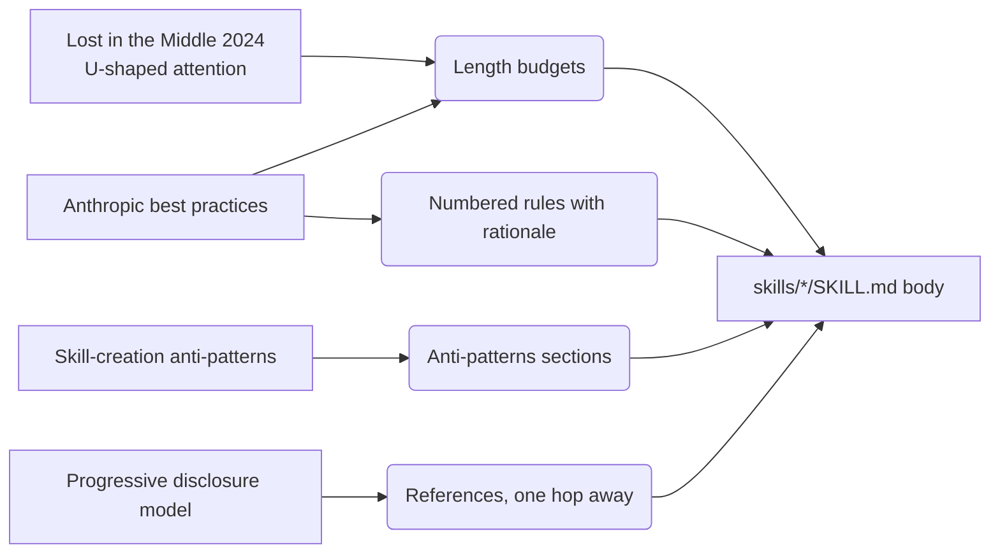
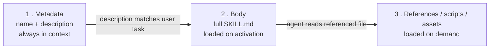

# Body anatomy

> **Why every `SKILL.md` body uses numbered rules with rationales, ships an `## Anti-patterns` section, sits well under the line cap, and keeps `references/` exactly one hop away.**

Activation is necessary but not sufficient. A skill that loads but isn't *acted on* fails as silently as one that doesn't load at all. The body's structure determines whether the rules fire.

---

## The empirical chain



Each branch maps to one design rule. The rest of this document walks each rule in turn.

---

## Length: target ~200 lines, hard-cap 500

| Source | Finding |
| --- | --- |
| [\[5\]](./sources.md#5) Liu et al., *Lost in the Middle*, TACL 2024 | U-shaped attention curve: information at the *start* and *end* of long contexts is recovered reliably; information in the middle degrades. Verified across GPT-3.5-Turbo, Claude-1.3, MPT-30B-Instruct, LongChat-13B. |
| [\[30\]](./sources.md#30) Hong, Troynikov, Huber, *Context Rot* (Chroma, Jul 2025) | Eighteen LLMs evaluated; performance degrades **non-uniformly** as input grows — and not only in the middle. Generalises and strengthens *Lost in the Middle*. |
| [\[31\]](./sources.md#31) Gao & Peng, *More with Less* (ByteDance, Oct 2025) | Token-cost grows quadratically with conversation turns; a fixed turn limit at the 75th percentile cuts cost **24–68 %** with minimal solve-rate impact. Long bodies aren't just slower to read, they're super-linearly expensive to keep around. |
| [\[2\]](./sources.md#2) Anthropic best practices | 500-line hard cap on `SKILL.md` bodies. |
| [\[8\]](./sources.md#8) Ibryam, "Skill Authoring Patterns" | Practical target ~200 lines; observation that beyond 200, instructions toward the bottom are read but not consistently acted on. |

**Applied in this repo:** every shipped skill body sits well under both the 500-line hard cap and the 200-line practical target — the catalogue clusters short, and none approaches the cap. The repo enforces the cap in [`AGENTS.md`](../AGENTS.md) (the body-length rule).

> The 500-line cap is non-negotiable; the 200-line target is a forcing function. If a skill grows past 200, the next question is "what should move to `references/`?", not "should I raise the limit?".

---

## Numbered rules with brief rationales

| Source | Finding |
| --- | --- |
| [\[2\]](./sources.md#2) | Bare ALL-CAPS MUST/NEVER imperatives are flagged as a yellow signal in Anthropic's `skill-creator`; pairing each rule with a one-line rationale gives the model a rubric for unanticipated cases. |
| [\[8\]](./sources.md#8) Pattern 6 ("Explain-the-Why") | The rationale is what lets a model extend the rule to a case the author didn't anticipate. |

**Applied in this repo:** every body pairs each rule with one or two sentences of justification — numbered `### N. <Rule>` headings or a numbered list under `## Rules` for the work guides, hard-constraint bullets for the personas. Examples worth opening:

- [`empirical-proof`](../skills/empirical-proof/SKILL.md) — rules 2–6 each pair the directive with the failure mode it prevents.
- [`write-research`](https://github.com/jcosta33/swarm-starter-kit/blob/main/.agents/skills/write-research/SKILL.md) (starter kit) — the rules alternate the directive with its evidentiary rationale.
- [`adversarial-review`](https://github.com/jcosta33/swarm-starter-kit/blob/main/.agents/skills/adversarial-review/SKILL.md) (starter kit) — the rules pair the directive with the inheritance-failure-mode it counters.

> Bare imperative without rationale is the structural equivalent of a magic constant: works for the cases the author imagined, falls apart on the next one.

---

## Anti-patterns sections, not just rules

| Source | Finding |
| --- | --- |
| [\[8\]](./sources.md#8) Pattern 9 ("Known Gotchas") | Documenting failure modes seen in real runs — *"the most valuable content of a mature skill"*. |
| [\[6\]](./sources.md#6) Skill-creation anti-pattern catalogue | Negative-example coverage is consistently load-bearing across analysed skills. |

**Applied in this repo:** every shipped skill carries its negative examples — an `## Anti-patterns` section, a `## Refuses` / red-flags table, or both. Many also include a `## What does not belong` section that names content that should live elsewhere — the negative-space sibling.

> Without negative examples, an agent has no prior for the edge cases that don't fit the happy path; it invents a fix, often wrong.

---

## References stay exactly one hop away

| Source | Finding |
| --- | --- |
| [\[2\]](./sources.md#2) § *Avoid deeply nested references* | When files reference other files, Claude often partial-reads with `head -100` and misses content; the official guidance is to keep `references/` files exactly one hop from `SKILL.md`. |
| [\[8\]](./sources.md#8) Pattern 4 ("Progressive Disclosure") | Reinforces the same rule: the agent loads the referenced file lazily; chained references are read partially. |

**Applied in this repo:** every skill with bundled resources keeps `references/*.md` exactly one level deep. No `references/` file links to another `references/` file across the repo. Verified by `Grep` over the file tree.

> Reference depth turns into partial reads, which turn into silent omissions in the skill's behaviour. The cap is structural, not stylistic.

---

## Task templates: a separate concern with its own doc

A `references/task-template.md` is a structural commitment with its own diminishing-returns curve, its own cost model (the produced task file accrues across sessions), and its own decision rubric. The full empirical case — Anthropic's canonical three-file pattern [\[20\]](./sources.md#20), the InfiAgent 21x ablation [\[29\]](./sources.md#29), the 6-criterion rubric, the deliberate exemption pattern applied in this repo — lives in [Task files](./task-files.md).

> **The short version:** ship a `task-template.md` only when working state is genuinely separate from the deliverable. If the deliverable *is* the working state, or the skill is a mindset persona or cross-cutting quality gate whose discipline lives entirely in `SKILL.md`, ship none.

---

## Progressive disclosure: metadata always, body when triggered, resources on demand

The open spec [\[1\]](./sources.md#1) defines a three-stage loading model and Anthropic's docs [\[2\]](./sources.md#2) document the cost characteristics:



**Applied in this repo:**

- The `description` is treated as the load-bearing artefact. See [Activation](./activation.md).
- The body is sized for the U-curve: short enough that nothing important sits in the middle's attention trough.
- `references/` files are kept one hop away so the on-demand load is reliable.

The persona discipline is the canonical example: each `persona-<name>/SKILL.md` is its own self-contained file (~115–135 lines, well under the 200-line target). Only the persona that the agent actually adopts loads — total context cost is *lower* than a single monolithic personas index would have been.

---

## What a well-shaped body looks like

A consolidated reference. The canonical skeleton (`empirical-proof` is the cleanest instance); shipped skills vary the carrier — numbered `## Rules` lists, `## Refuses` tables, hard-constraint bullets — while keeping the same parts. New contributions should match the parts, not necessarily the headings.

```text
---
name: <kebab-case>
description: <directive form, ~350–600 chars>     ← see Activation
---

# Skill: <Name>

## Purpose
<2–3 sentences. The failure mode this skill prevents.>

## Core rules
### 1. <Rule>
<rule body + 1–2 sentence rationale>

### 2. <Rule>
…

## What does not belong
<negative space — pointers to where adjacent content lives instead>

## Anti-patterns
<concrete failure modes with corrections, ❌ <pattern> → <correction>>

## Bundled resources
<one line per references/, scripts/, assets/ shipped alongside>
```

The repo's [`AGENTS.md`](../AGENTS.md) carries the editing rules this template encodes.

---

## See also

- [Activation](./activation.md) — how the body actually gets loaded in the first place.
- [Execution](./execution.md) — once loaded, why some rules still get skipped (and the fix).
- [Self-containment](./self-containment.md) — why bodies don't link to sibling skills.
- [Task files](./task-files.md) — when a skill warrants a `references/task-template.md`, and when it doesn't.
- [Sources](./sources.md) — full bibliography.
