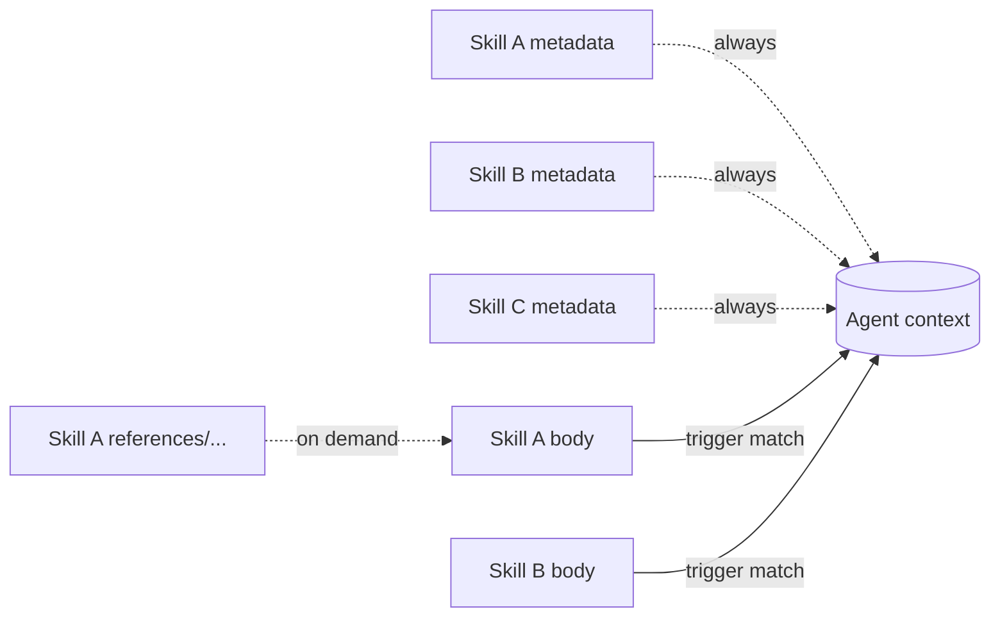
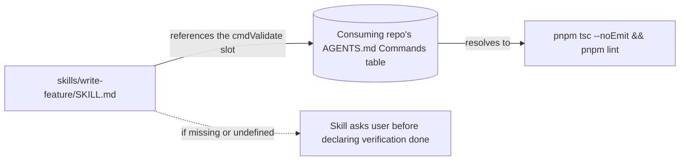

# Self-containment

> **Why no `SKILL.md` references another skill, why project-specific values resolve through `AGENTS.md`, and why the personas live in individual folders rather than one shared index.**

Skills install individually. A user who installs `write-feature` does not have `empirical-proof` in their context unless they also install it. The repo's structure has to assume that — every shipped skill stands alone, with no implicit dependencies on its siblings.

---

## The progressive-disclosure model

The open spec [\[1\]](./sources.md#1) defines skills as **independently loaded units**:



Each skill's metadata is in context regardless of which other skills are installed. The body loads when the description matches. References load on demand, scoped to that skill.

The structural consequence is non-trivial: **a skill cannot assume any other skill is in context**. If `write-feature` _expects_ `empirical-proof`'s discipline, that discipline has to be either restated inline or re-derivable from `write-feature` alone.

---

## Rule 1: no cross-skill references in `SKILL.md`

Anti-pattern catalogues converge on the same finding [\[6\]](./sources.md#6) — _"Reference Illusion"_: skills referencing files or skills that may not exist on the consumer's machine. The consequence is a dead reference that silently degrades behaviour.

| Source                                           | Finding                                                                              |
| ------------------------------------------------ | ------------------------------------------------------------------------------------ |
| [\[1\]](./sources.md#1) Open spec                | Each skill's metadata loads independently; no implicit ordering between skills.      |
| [\[2\]](./sources.md#2) Anthropic best practices | Recommends _"focused, composable skills"_.                                           |
| [\[6\]](./sources.md#6) Skill anti-patterns      | "Reference Illusion" — linking to skills/files that aren't guaranteed to be present. |

**Applied in this repo:** [`AGENTS.md`](../AGENTS.md) carries the rule: a skill must read
correctly with no other file from this repo installed. Two cases follow from that. A **load-bearing
dependency** — a rule the skill needs to function — is restated inline, never linked; where a sibling
is pointed at as the place that _carries_ a discipline, the pointer takes the `../<name>/SKILL.md`
form with an explicit "if installed" marker, so a missing sibling reads as an option, never a dead
dependency. A **disambiguation mention** — naming a related guide only to send a different task
elsewhere (`load fix-flaky-test, not this`) — may name the guide plainly, because it creates no
dependency: the skill still works standalone whether or not that guide is present. The test is
function, not syntax: if the skill breaks when the named guide is absent, it is a dependency and must
be restated inline; if it only loses a signpost, the plain mention is fine. Load-bearing cross-skill
_links_ live only in the repo's _meta_ docs (this `docs/` directory, `README.md`, `AGENTS.md`) —
never inside a `SKILL.md` body.

> A linked skill that isn't installed is a dead reference; an inline one-sentence restatement is robust.

---

## Cross-cutting stances: the canonical worked example

The cross-cutting stances are where the self-containment principle does its loudest work. Each is a fully standalone skill — installing the starter kit's `review-output` guide does not pull in `adversarial-review`, and installing that skill does not require the guide. (The stances that map 1:1 to one kind of work — architect, auditor, researcher, documentarian — are not shipped standalone at all; they live folded into their kit work guide, their single source, per [ADR-0093](https://github.com/jcosta33/corpus/blob/main/docs/adrs/0093-collapse-1to1-personas.md). Self-containment is exactly why that fold is clean: the guide already carries the whole discipline, with nothing to import.)

```mermaid
flowchart TD
    UR[User: "review this finished task"] --> AGT[Agent assesses task]
    AGT -->|matches description| RO["review-output loads (starter kit)"]
    AGT -->|matches description| PS[adversarial-review loads]
    RO -.no link to.-> PS
    PS -.no link to.-> RO
    RO & PS --> CTX[(Both in context, neither depends on the other)]
```

| Property                                                                     | How it's enforced                                                                                                                                                                                             |
| ---------------------------------------------------------------------------- | ------------------------------------------------------------------------------------------------------------------------------------------------------------------------------------------------------------- |
| **Each stance is a separate skill folder**                                   | `skills/persona-challenger/SKILL.md`, `skills/persona-surveyor/SKILL.md` — one folder per cross-cutting stance, each self-contained (the former `persona-skeptic` folded into the `adversarial-review` discipline).  |
| **Each stance activates from task assessment, not from cross-skill mention** | Each `description` names the task type the stance is for, e.g. _"ALWAYS apply when weighing a proposal before it's built"_. The agent loads it because the task matches, not because another skill mentioned it. |
| **No stance index / core / loader skill**                                    | There is no `personas-core`, no `personas` monolith. Each is independently installable.                                                                                                                       |
| **Stances are not referenced from any other skill**                          | `Grep` over `skills/` for `persona-` returns no cross-skill dependency: the only non-stance hits are in `adversarial-review/SKILL.md`, documenting that it absorbed the retired `persona-skeptic` stance — not loading it. Every other match is within a stance file itself.    |

> A consumer who installs only the kit's `review-output` and this catalog's `adversarial-review` gets the same behaviour as one with everything installed — neither file mentions the other.

---

## Rule 2: project-specific values come from `AGENTS.md`

Skills are universal. The consuming repo holds project-specific values. Hardcoding `pnpm tsc --noEmit && pnpm lint` into a skill couples it to one stack and breaks every other consumer.

The repo solves this with the `AGENTS.md` contract — a Commands table in the consuming repo's
`AGENTS.md` mapping abstract slot names to real commands (the
[Corpus starter kit](https://github.com/jcosta33/corpus-starter-kit/blob/main/AGENTS.md) ships
the template). Skills reference the slots by name and degrade gracefully when an entry is
missing.



The [open `AGENTS.md` convention](https://agents.md) is adopted by Cursor, Codex, Claude Code, OpenCode, and others [\[19\]](./sources.md#19); the contract format used here extends it with an explicit Commands table.

### What the contract guarantees

| Slot                                                   | Read by                                                                                                                          |
| ------------------------------------------------------ | -------------------------------------------------------------------------------------------------------------------------------- |
| `cmdValidate` (and `cmdTypecheck` / `cmdLint`)         | Any skill whose discipline includes running typecheck + lint as part of self-review.                                             |
| `cmdTest`                                              | Any skill that runs the test suite (feature, fix, refactor, rewrite, migration, performance, testing, flaky-test stabilisation). |
| `cmdFormat`                                            | Any skill that closes a session by formatting touched files.                                                                     |
| Project facts (stack, architecture rules, conventions) | All skills, for orientation.                                                                                                     |

### What it deliberately doesn't cover

Some skills reference values _outside_ the standard contract — a benchmark command for perf work, a dependency-validator for refactor / migration / review work, a doc-lint command for documentation work. Convention used throughout the repo: **the skill names the descriptive concept ("the project's benchmark command"), tells the agent to ask the user for the concrete value, and flags it in the PR**. New `AGENTS.md` sections are not added unilaterally from inside a skill.

---

## Rule 3: no citations or external sourcing in `SKILL.md`

A `SKILL.md` is a **product** — the instructions an agent runs — not a paper. Bibliography markers
(`[\[48\]](../../docs/sources.md#48)`) and provenance ("the pattern from `oil-oil/codex-explore-skill`",
a GitHub or DOI URL) do not belong in a skill body. Two reasons, the same ones behind Rule 1:

- **It breaks standalone install.** A `../../docs/sources.md#48` link points _outside_ the skill folder;
  `npx skills add --skill <name>` ships only that folder, so every such link 404s the moment the skill is
  installed on its own — the "Reference Illusion" again, in citation form.
- **It is a category error.** Sourcing is documentation. The evidence base lives in this `docs/` directory
  (`sources.md` + the science pages — which _do_ cite freely; that is their whole job). The product states
  the discipline; the _why it's true_ is a doc concern.

**Applied:** a skill names the technique and its plain rationale ("agreement is not a correctness signal"),
never the citation; external best-of-breed provenance is recorded in [`sources.md`](./sources.md), not in
the skill. Tool names the agent actually **uses** (Semgrep, CodeQL, Diátaxis) are instructions, not
sourcing, and stay. The gate: `grep -rniE 'sources\.md|github\.com|https?://|doi\.org|\[\\[[0-9]' skills/`
returns nothing.

---

## Why the cost is worth it

| Benefit                       | Mechanism                                                                                                                                |
| ----------------------------- | ---------------------------------------------------------------------------------------------------------------------------------------- |
| **Selective install works**   | Any subset of the catalogue can be installed; nothing breaks because no skill assumes a sibling is present.                              |
| **Skills are stack-agnostic** | The same skill body runs in a TypeScript monorepo, a Rust crate, or a Python service — only `AGENTS.md` differs.                         |
| **Reviews are local**         | A skill's correctness is determined by reading just that skill plus the `AGENTS.md` contract. No need to model cross-skill interactions. |
| **Forks are cheap**           | A team can vendor a single skill into their own collection without porting an entire dependency graph.                                   |

The cost is restated rules. The same discipline (e.g. _paste the actual output, not a paraphrase_) appears in `empirical-proof`, in `write-feature`, in `write-fix`, etc. — usually as one or two inline sentences rather than a link. The duplication is deliberate, not a TODO.

The densest cluster is the behavior-preserving-transformation rule family — the equivalence check that would fail on drift, the string-form deletion grep, and the shim with a removal criterion — shared by `write-refactor`, `write-rewrite`, and `write-migration`, each phrased for its own kind. A shared "core" skill is ruled out ([Scope](./scope.md)), so these three are kept in sync by reviewing them together whenever one's shared rule changes; the wording stays adapted per kind, but the rule must not drift apart in substance.

---

## State externalisation makes self-containment work

Self-containment relies on each skill carrying its own state. If one skill had to rely on another keeping a _shared in-memory_ picture of what was decided, the skills wouldn't actually be independent — they'd be implicitly coupled through the agent's working memory.

The repo's answer is **file-based state externalisation**: every long-running task writes to a local task file (e.g. a gitignored `.tasks/<slug>.md` on the dev's machine). Each skill reads the file, writes to it, and assumes nothing about what other skills did beyond what's recorded there. The file is personal working memory, not a team artefact — see [Task files § Where the task file lives](./task-files.md#where-the-task-file-lives-gitignored-local-personal).

The empirical case for this is unusually direct. InfiAgent [\[29\]](./sources.md#29) ran an ablation study removing file-based state externalisation from their long-horizon agent and measured a **21× performance degradation**. Anthropic's three-file pattern [\[20\]](./sources.md#20) and the Claude Code Tasks system [\[23\]](./sources.md#23) converge on the same shape from a different angle. The full case is in [Task files](./task-files.md).

For self-containment specifically, the implication is structural: **state is shared through the file, not through implicit context**. A skill that needs prior findings reads them from the task file. A skill that needs to record a decision writes it to the task file. No skill assumes another skill kept anything in attention.

> Without file-based state, "self-contained skills" would be a polite fiction — every skill would secretly depend on the agent's memory of what its siblings did. The task file is what makes the independence real.

---

## See also

- [Activation](./activation.md) — exclusion clauses name the _task types_ a skill is not for, never sibling skill names. The agent disambiguates by matching the user's task to whichever sibling's `ALWAYS apply when…` clause triggers.
- [Body anatomy](./body-anatomy.md) — body length budgets factor in inline restatement.
- [Scope](./scope.md) — the same self-containment principle is what excludes any "personas-core" or "loader" index skill from the repo.
- [Task files](./task-files.md) — the file-based state externalisation that lets self-contained skills coordinate.
- [Sources](./sources.md) — full bibliography.
