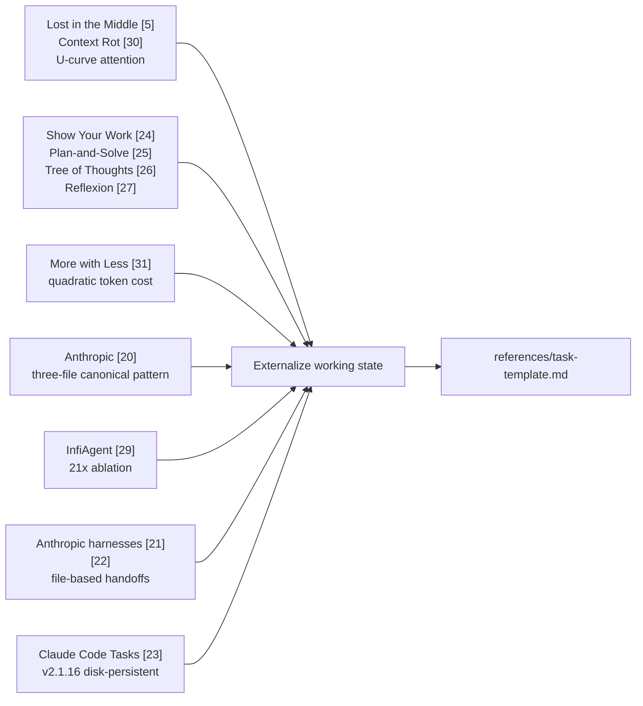

# Task files

> **Why most workflow skills ship a `references/task-template.md`, why a few deliberately don't, and the empirical case for externalising task state into a markdown file at all.**

Agent context is finite. A long-running task accumulates intermediate findings, half-formed hypotheses, abandoned plan branches, and decisions whose rationale lives only in the chat. When the next session opens — or even just when the model's attention is pulled to a new sub-task — that state is gone unless it has been written to disk.

Task files are the repo's response. They are the **agent's working memory, externalised**.

---

## What this isn't: a replacement for Plan-mode files

Modern agent harnesses already produce planning artefacts. Cursor's _Plan mode_ and Claude Code's _/plan_ both write a markdown plan to disk before execution; that plan describes intent, decomposition, and ordering. The task templates in this repo are **not a replacement for those plans** — they are an _auxiliary_ to them.

|                              | Plan-mode artefact (Cursor, Claude Code, etc.)        | This repo's task template                                                                                                                                   |
| ---------------------------- | ----------------------------------------------------- | ----------------------------------------------------------------------------------------------------------------------------------------------------------- |
| **Voice**                    | Descriptive — _"we will do X, then Y"_                | Imperative — _"validate after every batch; paste the output here"_                                                                                          |
| **Primary purpose**          | Decompose a goal into ordered steps before execution  | Carry the **operational discipline** through execution: self-review gates, validation pastes, hypothesis tracking, decisions, promotion of durable findings |
| **What it captures**         | The plan                                              | The plan's _application_ — observed behaviour, paste-output proofs, what was tried and discarded, what to promote out of the file                           |
| **Lifetime**                 | Often session-scoped; superseded once the work begins | Lives across sessions; the agent re-reads it on resume; the `## Self-review` block must be empirically backed before close                                  |
| **Failure mode it prevents** | Starting code without thinking                        | Skipping verification, losing findings, conflating observation with inference, finalising without paste-output proof                                        |

The two are complementary. A consuming repo can use Plan mode to draft the _plan_, then instantiate one of these task templates to carry the _imperative discipline_ — the validation gates, the forced visible output, the iteration trail, the decision log. The plan answers _what to do_; the task file answers _how to know it was done correctly_.

> If your harness's plan-mode file is doing the imperative work too — listing self-review gates, demanding paste-output, tracking hypotheses — you don't need a task template on top. The empirical case below applies to the _function_ (externalising state with imperative gates), not to a specific file. The repo ships templates because most plan-mode artefacts stop at the descriptive layer.

---

## The empirical chain

Eight independent sources converge on the same finding: **agents perform measurably better when working state lives in a file rather than only in context**.

---

## Anthropic's canonical pattern

The most authoritative single source is Anthropic's own engineering guidance [\[20\]](./sources.md#20). It defines a **three-file note-taking pattern** for long-running agents:

| Anthropic file    | Purpose                                                 | Maps to our task-template section(s)                                               |
| ----------------- | ------------------------------------------------------- | ---------------------------------------------------------------------------------- |
| `task_plan.md`    | The plan — what we're trying to do, in order            | `## Scope` + `## Progress checklist` (+ `## Plan`, where the workflow carries one) |
| `progress_log.md` | Running session log — what was tried, what was observed | `## Evidence` (pasted output) + `## Findings`                                      |
| `decisions.md`    | Durable design choices and their rationale              | `## Decisions`                                                                     |

Our templates collapse the three files into one. The trade-off is deliberate:

- **One file** = one resumption point. The agent reads a single task file (e.g. `.tasks/<slug>.md`) to recover state, not three.
- **One file** = single artefact to manage per task. Simpler to gitignore, simpler to clean up at task close.
- **Three files** would mean per-task subdirectories and a coordination concern about which file is authoritative when they disagree.

The discipline is the same; the artefact count differs. Each task template encodes the same lifecycle Anthropic describes — pre-flight read, in-flight update, pre-close promotion — inside the consolidated single-file format.

---

## Where the task file lives: gitignored, local, personal

Task files are **the dev's personal working memory, not a team artefact**. They live in a gitignored folder on the dev's machine (the convention used by this repo's templates is `.tasks/<slug>.md` at the consuming repo's root, but any local-only path works) and are never committed.

|                    | Task file                                                                                         | Deliverable                                                                                                                 |
| ------------------ | ------------------------------------------------------------------------------------------------- | --------------------------------------------------------------------------------------------------------------------------- |
| **What it is**     | The agent's scratchpad: plan, progress, decisions, hypothesis tracker, paste-output verifications | The artefact the work produces: spec, audit, bug-report, ADR, code change + regression test                                 |
| **Where it lives** | A gitignored local folder (`.tasks/<slug>.md` by convention)                                      | The project's docs / source tree (`<your-specs-dir>/<slug>.md`, `<your-audits-dir>/<slug>.md`, the source files themselves) |
| **Lifetime**       | Until the deliverable lands; then discarded (no archival value)                                   | As long as the project itself                                                                                               |
| **Visible in PRs** | No                                                                                                | Yes                                                                                                                         |
| **Per-machine**    | Yes                                                                                               | No, shared via git                                                                                                          |

If the task file were committed instead, the repo would accumulate thousands of stale scratchpads within weeks — and the deliverables (which _are_ worth keeping in git history) would be diluted in a sea of working memory. The split is structural: the task file is the _workspace_, the deliverable is the _output_.

> **Setup:** add `.tasks/` (or whatever local path the consuming repo prefers) to `.gitignore`. The template's `## Deliverable` block is the part that gets promoted to the deliverable's final home; everything outside that block stays on the dev's machine.

---

## The empirical evidence

### Scratchpads make multi-step reasoning easier

[\[24\]](./sources.md#24) Nye et al., _Show Your Work_ (ICLR 2022). Letting a model emit intermediate steps to a scratchpad improves accuracy on multi-step problems. The original framing is per-prompt (the scratchpad is the model's own working buffer), but it generalises directly to agent tasks: the task file is the durable scratchpad.

> _"Even though models must predict many more tokens, they still perform better at predicting final results because individual prediction steps are easier."_

### Explicit plans beat ad-hoc execution

[\[25\]](./sources.md#25) Wang et al., _Plan-and-Solve Prompting_ (ACL 2023). Devise an explicit plan before executing, then carry out subtasks. Outperforms vanilla zero-shot CoT across arithmetic, commonsense, and symbolic reasoning benchmarks.

The `## Progress checklist` section in every task template (plus `## Plan`, where the workflow carries one) is the externalised version of the same discipline.

### Multi-path search outperforms linear chains

[\[26\]](./sources.md#26) Yao et al., _Tree of Thoughts_ (NeurIPS 2023). On Game of 24, GPT-4 jumps from 4 % (CoT) to **74 % (ToT)** when allowed to explore, evaluate, and backtrack across reasoning paths.

Templates capture this pattern where it matters: `fix-flaky-test` ships a `## Hypothesis tracker` and `write-fix` a `## Hypothesis trail`, so competing explanations are tracked, evaluated, and pruned in writing rather than implicitly.

### Verbal reflection beats no reflection

[\[27\]](./sources.md#27) Shinn et al., _Reflexion_ (NeurIPS 2023). Verbal self-reflection between trials, stored as text and re-read on the next attempt, drives **91 % pass@1 on HumanEval (vs 80 % GPT-4 baseline, +11 pp)**.

The repo's `## Self-review` discipline is the per-task version of this pattern. For iterative skills (`write-fix`, `fix-flaky-test`), the per-trial version lives in the `## Hypothesis trail` and `## Hypothesis tracker` sections — what was tried, what failed, what each rejection teaches.

### Removing the file destroys performance

[\[29\]](./sources.md#29) Yu et al., _InfiAgent_ (2026). The single most direct piece of evidence in this document: an ablation study where removing file-based state externalization caused **a 21x performance degradation on long-horizon tasks**. The architecture combines a file system with a k-most-recent action window — implicit in the `## Findings` and `## Decisions` sections of our templates.

### Context engineering, not model scale, is the bottleneck

[\[28\]](./sources.md#28) Yuksel, _PAACE_ (Dec 2025). _"Modern agentic failures are overwhelmingly context failures, not model failures."_ Plan-aware context selection — the task file _is_ the plan, and the agent re-reads only the relevant section per turn — is the practical realisation.

### Long contexts have super-linear cost

[\[30\]](./sources.md#30) Hong et al., _Context Rot_ (Chroma, Jul 2025); [\[31\]](./sources.md#31) Gao & Peng, _More with Less_ (ByteDance, Oct 2025). Performance degrades non-uniformly as input grows; token cost grows quadratically with conversation turns. **Implication for templates: keep them short.** The repo's templates target <200 lines for exactly this reason — see [Body anatomy § Length](./body-anatomy.md#length-target-200-lines-hard-cap-500).

### Vendor patterns echo the same structure

[\[21\]](./sources.md#21) Anthropic harnesses; [\[22\]](./sources.md#22) Long-running app harness design; [\[23\]](./sources.md#23) Claude Code Tasks system v2.1.16. Every major implementation converges on the same shape: a markdown file on disk that survives session boundaries. Whether that file is committed depends on its role — some teams check plan files into the repo so they double as a team artefact, while Anthropic's three-file pattern [\[20\]](./sources.md#20) and the Claude Code Tasks system [\[23\]](./sources.md#23) treat them as local working state. **This repo follows the latter** — task files are personal, gitignored, and discarded once the deliverable lands.

---

## Decision rubric: when does a skill warrant a task template?

A `references/task-template.md` is a structural commitment. Every time the skill activates, the agent's prior is _"instantiate this template into a tasks file"_. That's load-bearing context with the same diminishing-returns curve as the body itself.

A skill warrants a `task-template.md` **iff at least three of the six criteria hold**:

| Criterion                             | Question                                    | Evidence                                                                                          |
| ------------------------------------- | ------------------------------------------- | ------------------------------------------------------------------------------------------------- |
| **M** Multi-session                   | Realistic to span >1 agent session          | [\[21\]](./sources.md#21)[\[22\]](./sources.md#22)[\[23\]](./sources.md#23) — file-based handoffs |
| **I** Iterative gates                 | Validate → fix → re-validate cycles         | [\[27\]](./sources.md#27) — Reflexion's iteration loop                                            |
| **H** Hypothesis tracking             | Multiple competing explanations to evaluate | [\[26\]](./sources.md#26) — Tree of Thoughts                                                      |
| **P** Multi-stage plan                | ≥4 distinct phases                          | [\[25\]](./sources.md#25) — Plan-and-Solve                                                        |
| **S** State separate from deliverable | Working state is not the final artefact     | [\[20\]](./sources.md#20) — three-file pattern                                                    |
| **G** Verification gates              | Paste-output empirical proof required       | [\[4\]](./sources.md#4) — execution failure mode                                                  |

---

## Applied in this repo

### Skills that ship a template

The kit's code-authoring skills (the `write-*` family) each ship a `references/task-template.md`, and the catalog's `fix-flaky-test` an equivalent `references/notes.md` — each scoring ≥3 on the MIHPSG rubric. The shape of the score predicts the shape of the template:

| Score profile                                                                                                                                                                       | Examples                                                                                                    | What ships                                                                                                                                                                    |
| ----------------------------------------------------------------------------------------------------------------------------------------------------------------------------------- | ----------------------------------------------------------------------------------------------------------- | ----------------------------------------------------------------------------------------------------------------------------------------------------------------------------- |
| **Full house (M·I·H·P·S·G ≈ 6/6)** — multi-session, iterative, hypothesis search, multi-stage plan, state separate from deliverable, paste-output gates                             | `fix-flaky-test`, `write-fix`                                                                               | Full scaffold with a hypothesis section (`## Hypothesis tracker` / `## Hypothesis trail`), paste-output `## Evidence` gates, `## Self-review`, `## Findings` / `## Decisions` |
| **Plan + state + gates (M·P·S·G ≈ 5/6)** — multi-session, multi-stage, state separate, paste-output gates; no formal hypothesis tracking                                            | `write-feature`, `write-refactor`, `write-rewrite`, `write-migration`, `write-testing`, `write-performance` | The same scope / progress / evidence scaffold without a multi-row tracker; `write-performance` carries a single `## Hypothesis` field                                         |
| **Authorial — plan + decisions, light gates (≈ 3–4/6)** — multi-stage authoring with state separate from the final document, but the deliverable itself is the proof of correctness | `write-documentation`                                                                                       | Plan + decisions + findings + self-review; lighter paste-output gates (the verified examples are the proof)                                                                   |

The [Suspec starter kit's](https://github.com/jcosta33/suspec-starter-kit) authoring guides (`write-spec`, `write-audit`, `write-research`, `write-bug-report`, …) sit in the same authorial band, but in the Suspec workflow their working state lives in the task packet itself, so they ship no separate template. The catalog's `adversarial-review` is the one discipline-skill that warrants a session frame — it ships a framework-free `references/review-notes.md`.

### Skills that deliberately ship none

The rubric exempts two structural categories: persona skills and cross-cutting quality-gate skills. Both sit outside the per-task scaffold model — personas condition mindset for whichever workflow is in play; quality gates surface inside that workflow's task file rather than owning their own.

| Category               | Why                                                                                                                                                                                                                 |
| ---------------------- | ------------------------------------------------------------------------------------------------------------------------------------------------------------------------------------------------------------------- |
| All `persona-*` skills | Single-load mindset conditioning, not a workflow. The persona scopes _how_ the agent thinks during whichever workflow it accompanies; the working state belongs to the workflow's task file, not the persona's.     |
| `empirical-proof`      | A cross-cutting quality gate whose discipline lives entirely in `SKILL.md` and surfaces inside whichever workflow's task file is in play (`## Self-review`). No scaffold of its own.                                |
| `implement-task`       | The Suspec task packet **is** the working state — the guide fills the packet's own sections rather than shadowing it with a second file. If the deliverable and the working state are the same document, ship none. |

---

## Counter-evidence: when state externalization hurts

The same body of research that justifies task files also bounds them. Externalisation is not free — and beyond a threshold it inverts.

| Source                                                         | Failure mode                                                            | Implication                                                                                                             |
| -------------------------------------------------------------- | ----------------------------------------------------------------------- | ----------------------------------------------------------------------------------------------------------------------- |
| [\[32\]](./sources.md#32) ETH Zurich, _Evaluating AGENTS.md_   | LLM-generated context files cost +20 % with -3 % success                | Don't auto-generate or pad templates; tool-specific commands are 50× more impactful than narrative content              |
| [\[33\]](./sources.md#33) Lulla et al., _AGENTS.md efficiency_ | Efficiency gains plateau; redundancy penalises                          | Each section must earn its keep                                                                                         |
| [\[31\]](./sources.md#31) Gao & Peng, _More with Less_ (ByteDance) | Quadratic token cost with turns; 75th-percentile turn cap saves 24–68 % | Templates >200 lines push load-bearing content into the U-curve trough [\[5\]](./sources.md#5)[\[30\]](./sources.md#30) |
| [\[6\]](./sources.md#6) "Template Theatre" anti-pattern        | Templates that ship but rarely apply pollute the agent's prior          | Skills whose discipline lives entirely in `SKILL.md` (personas, cross-cutting quality gates) ship no per-task scaffold  |

The decision rubric above is the applied form of these constraints.

---

## What good looks like in this repo

| Property                                                      | How it's enforced                                                                                                                                                                                                                                                                                                                                                                                                                                                                                                       |
| ------------------------------------------------------------- | ----------------------------------------------------------------------------------------------------------------------------------------------------------------------------------------------------------------------------------------------------------------------------------------------------------------------------------------------------------------------------------------------------------------------------------------------------------------------------------------------------------------------- |
| **Templates target <200 lines**                               | Most ship under 200 lines; the U-curve [\[5\]](./sources.md#5)[\[30\]](./sources.md#30) is the binding constraint. The state-heaviest template, [`fix-flaky-test`](../skills/fix-flaky-test/references/notes.md), runs longer (Test under stabilization · Flake category · Reproduction protocol · Reproduction evidence · Hypothesis tracker · Root cause · Progress checklist · Fix evidence) — every section is load-bearing for that workflow. The 500-line hard cap [\[2\]](./sources.md#2) still applies. |
| **No cross-skill references**                                 | Templates name the _concept_ (e.g., "the project's benchmark command"), not a sibling skill — see [Self-containment](./self-containment.md)                                                                                                                                                                                                                                                                                                                                                                             |
| **Section discipline maps to Anthropic's three-file pattern** | Plan + Progress = task_plan; Findings = progress_log; Decisions = decisions [\[20\]](./sources.md#20)                                                                                                                                                                                                                                                                                                                                                                                                                   |
| **Iterative skills carry a hypothesis trail**                 | the kit's `write-fix` ships `## Hypothesis trail`; [`fix-flaky-test`](../skills/fix-flaky-test/references/notes.md)'s `## Hypothesis tracker` records what each rejection teaches — both per Reflexion [\[27\]](./sources.md#27)'s verbal-feedback loop                                                                                                                                                                                                                |
| **No template ships without ≥3 of MIHPSG**                    | A handful of skills deliberately ship none on this basis                                                                                                                                                                                                                                                                                                                                                                                                                                                                |
| **No `## Domain skills` placeholder section**                 | Removed from all task templates — the section was an empty placeholder after the self-containment cleanup, costing tokens against the compliance ceiling [\[32\]](./sources.md#32) without doing measurable work                                                                                                                                                                                                                                                                                                        |

---

## See also

- [Body anatomy § Length](./body-anatomy.md#length-target-200-lines-hard-cap-500) — the U-curve constraint that bounds template size.
- [Self-containment](./self-containment.md) — why templates name concepts, not sibling skills.
- [Execution](./execution.md) — Reflexion's verbal-feedback loop is the per-rule version of the per-task discipline here.
- [Sources](./sources.md) — full bibliography.
